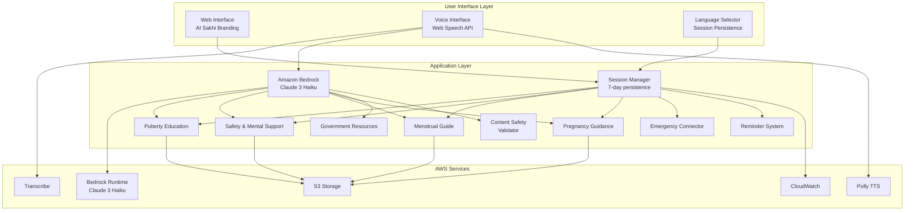

# Design Document: AI Sakhi - Voice-First Health Companion

## Overview

AI Sakhi is a Flask-based web application that provides voice-first health education and guidance for women and girls in rural areas. The system integrates AWS services for speech processing, content delivery, and scalable infrastructure while maintaining strict boundaries around medical advice. The application focuses on accessibility through multi-language support, audio-first interactions, and culturally sensitive design patterns.

The architecture follows a modular approach with five core educational modules (Puberty, Safety, Menstrual Guide, Pregnancy, Government Resources) supported by voice processing, content management, and user interface layers. All content uses public and synthetic data sources, ensuring privacy while providing trusted health education.

## Architecture

The system follows a three-tier architecture with AI-powered natural language processing:

### Presentation Layer
- **Flask Web Framework**: Serves the web application on port 8080
- **Voice Interface**: Handles speech recognition and synthesis with Web Speech API fallback
- **Responsive UI**: Women-centric design with AI Sakhi branding (mother-daughter imagery, warm colors)
- **Multi-language Support**: Flask-Babel integration with session persistence (7-day lifetime)
- **Session Management**: Permanent sessions with localStorage backup for language preferences

### Application Layer
- **AI Processing**: Amazon Bedrock (Claude 3 Haiku) for intelligent natural language understanding
- **Content Modules**: Five specialized health education modules with pattern-matching fallback
- **Session Management**: User state and progress tracking with 30-minute timeout
- **Language Processing**: Multi-language AI responses (Hindi, English, Bengali, Tamil, Telugu, Marathi)
- **Emergency Routing**: Immediate connection to human help services with offline fallback
- **Content Safety**: Validation layer ensuring no medical diagnosis in responses
- **Reminder System**: Prenatal appointment scheduling and notifications

### Infrastructure Layer
- **AWS Bedrock**: Claude 3 Haiku model for AI-powered responses with mock mode for development
- **AWS S3**: Audio/video content storage and delivery
- **AWS Transcribe**: Speech-to-text conversion (mock mode available)
- **AWS Polly**: Text-to-speech synthesis with regional language support (mock mode available)
- **AWS CloudWatch**: Application monitoring and logging
- **CloudFormation**: Infrastructure as Code with multi-AZ and single-AZ deployment options
- **Python Virtual Environment**: Isolated dependency management



## Components and Interfaces

### AI Processing System

**Amazon Bedrock Integration**
- **Purpose**: Provides intelligent natural language understanding and response generation
- **Model**: Claude 3 Haiku (anthropic.claude-3-haiku-20240307-v1:0)
- **Features**:
  - Multi-language support (Hindi, English, Bengali, Tamil, Telugu, Marathi)
  - Language-specific system prompts ensuring no medical diagnosis
  - Culturally sensitive responses
  - 300 token max response length for concise answers
  - Temperature 0.7 for balanced creativity and consistency
- **Fallback Strategy**: Pattern-matching module routing when Bedrock unavailable
- **Mock Mode**: Development mode with simulated responses (no AWS credentials required)

**Interface Contract**:
```python
def _get_bedrock_response(query: str, language_code: str) -> Optional[str]:
    """
    Get AI response from Amazon Bedrock.
    Returns None if Bedrock unavailable, triggering fallback.
    """
    
def _get_mock_bedrock_response(query: str, language_code: str) -> str:
    """
    Generate mock Bedrock response for development.
    Topic-aware responses based on query keywords.
    """
```

### Voice Processing System

**SpeechProcessor Class**
- **Purpose**: Manages speech recognition and synthesis
- **Dependencies**: AWS Transcribe, AWS Polly, Flask session
- **Key Methods**:
  - `transcribe_audio(audio_data, language_code)`: Converts speech to text
  - `synthesize_speech(text, language_code, voice_id)`: Converts text to speech
  - `detect_language(audio_data)`: Identifies spoken language
  - `process_voice_query(audio_data)`: End-to-end voice processing

**VoiceInterface Class**
- **Purpose**: Orchestrates complete voice interaction pipeline
- **Features**:
  - Voice input processing with audio data validation
  - Text input fallback for browser-based transcription
  - Emergency detection with regex patterns
  - AI-first routing with pattern-matching fallback
  - Response audio generation
  - Interaction statistics tracking
- **Processing Pipeline**:
  1. Audio/text input received
  2. Session validation/creation
  3. Emergency detection check
  4. AI processing (Bedrock) or pattern matching
  5. Content safety validation
  6. Audio response synthesis
  7. Statistics update

**Interface Contract**:
```python
class SpeechProcessor:
    def transcribe_audio(self, audio_data: bytes, language_code: str) -> str
    def synthesize_speech(self, text: str, language_code: str, voice_id: str) -> bytes
    def detect_language(self, audio_data: bytes) -> str
    def process_voice_query(self, audio_data: bytes) -> dict

class VoiceInterface:
    def process_voice_input(self, audio_data: bytes, session_id: str, 
                          language_code: Optional[str]) -> VoiceInteractionResult
    def process_text_input(self, text: str, session_id: str, 
                         language_code: str) -> VoiceInteractionResult
    def _get_bedrock_response(self, query: str, language_code: str) -> Optional[str]
    def _route_to_module(self, query: str, language_code: str, session) -> Tuple[str, str]
```

### Session Management System

**SessionManager Class**
- **Purpose**: Manages user sessions with persistence
- **Configuration**:
  - Session timeout: 30 minutes of inactivity
  - Permanent sessions: 7-day lifetime
  - Cookie settings: SameSite=Lax, Secure=False (dev), Secure=True (prod)
- **Features**:
  - Session creation with language preference
  - Activity tracking and timeout management
  - Language preference persistence
  - Session data preservation during language changes
- **Storage**: Flask session with filesystem backend and localStorage backup

**Interface Contract**:
```python
class SessionManager:
    def create_session(self, language_code: str) -> UserSession
    def get_session(self, session_id: str) -> Optional[UserSession]
    def update_session(self, session_id: str, **kwargs) -> None
    def update_session_activity(self, session_id: str) -> None
    def get_active_session_count(self) -> int
```

### Content Management System

**ContentManager Class**
- **Purpose**: Retrieves and manages educational content
- **Dependencies**: AWS S3, Flask-Babel, session management
- **Key Methods**:
  - `get_module_content(module_name, language_code)`: Retrieves localized content
  - `get_audio_content(content_id, language_code)`: Fetches audio files
  - `get_video_content(content_id, language_code)`: Fetches video files
  - `search_content(query, module_name)`: Content search functionality

**Interface Contract**:
```python
class ContentManager:
    def get_module_content(self, module_name: str, language_code: str) -> dict
    def get_audio_content(self, content_id: str, language_code: str) -> str
    def get_video_content(self, content_id: str, language_code: str) -> str
    def search_content(self, query: str, module_name: str) -> list
```

### Health Education Modules

**BaseHealthModule Abstract Class**
- **Purpose**: Common interface for all health education modules
- **Key Methods**:
  - `get_content_by_topic(topic, language_code)`: Topic-specific content
  - `handle_user_query(query, language_code)`: Process user questions
  - `get_emergency_resources()`: Emergency contact information
  - `validate_content_safety()`: Ensure no medical diagnosis

**Specialized Module Classes**:
- **PubertyEducationModule**: Body changes, menstruation, hygiene education
- **SafetyMentalSupportModule**: Good/bad touch awareness, emotional support
- **MenstrualGuideModule**: Product comparison and selection guidance
- **PregnancyGuidanceModule**: Nutrition, danger signs, appointment reminders
- **GovernmentResourcesModule**: Government health schemes and programs information

### User Interface Components

**AI Sakhi Logo Integration**
- **Purpose**: Brand identity and emotional connection with users
- **Design**: Mother-daughter imagery representing trust and generational knowledge transfer
- **Colors**: Warm pink, soft orange, gentle purple reflecting femininity and care
- **Placement**: Header, splash screen, favicon, and loading screens
- **Cultural Elements**: Traditional Indian attire, bindi, and cultural sensitivity

**VoiceInterface Component**
- **Purpose**: Browser-based voice interaction
- **Technologies**: Web Speech API, WebRTC, JavaScript
- **Features**: Real-time speech recognition, audio playback, visual feedback

**LanguageSelector Component**
- **Purpose**: Multi-language support interface
- **Features**: Audio language labels, visual language switching, session persistence

**ModuleNavigator Component**
- **Purpose**: Navigate between health education modules
- **Features**: Large touch targets, icon-based navigation, voice commands

## Data Models

### User Session Model
```python
class UserSession:
    session_id: str
    language_preference: str
    current_module: str
    interaction_history: list
    emergency_contacts: dict
    accessibility_preferences: dict
    created_at: datetime
    last_active: datetime
```

### Content Item Model
```python
class ContentItem:
    content_id: str
    module_name: str
    topic: str
    content_type: str  # 'audio', 'video', 'text'
    language_code: str
    s3_url: str
    duration_seconds: int
    transcript: str
    safety_validated: bool
    created_at: datetime
```

### Voice Interaction Model
```python
class VoiceInteraction:
    interaction_id: str
    session_id: str
    user_audio_transcript: str
    system_response_text: str
    system_audio_url: str
    language_code: str
    confidence_score: float
    processing_time_ms: int
    timestamp: datetime
```

### Emergency Contact Model
```python
class EmergencyContact:
    contact_id: str
    contact_type: str  # 'helpline', 'medical', 'counseling'
    phone_number: str
    region: str
    language_support: list
    availability_hours: str
    description: str
```

### Government Scheme Model
```python
class GovernmentScheme:
    scheme_id: str
    scheme_name: str  # 'JSY', 'PMSMA', 'JSSK', 'RCH', 'Swasth Nari'
    scheme_type: str  # 'maternity', 'child_health', 'reproductive_health'
    eligibility_criteria: list
    benefits: list
    application_process: str
    required_documents: list
    contact_details: dict
    regional_variations: dict
    language_code: str
    last_updated: datetime
```

Now I need to use the prework tool to analyze the acceptance criteria before writing the Correctness Properties section:

<function_calls>
<invoke name="prework">
<parameter name="featureName">sakhi-saathi-ai

## Correctness Properties

*A property is a characteristic or behavior that should hold true across all valid executions of a system—essentially, a formal statement about what the system should do. Properties serve as the bridge between human-readable specifications and machine-verifiable correctness guarantees.*

Based on the prework analysis and property reflection, the following properties ensure system correctness:

### Property 1: Content Language Consistency
*For any* user session and content request, when a language is selected, all delivered content (audio, text, video) should be in that selected language, and language switching should preserve session state and module progress.
**Validates: Requirements 1.1, 6.2, 6.3**

### Property 2: Module Content Completeness
*For any* health education module request, the returned content should include all required topics for that module: puberty content should cover menstruation, hygiene, and body development; safety content should include good/bad touch explanations; menstrual guide should explain pads, cups, and cloth options with cost and hygiene details; pregnancy content should include nutrition tips and danger signs.
**Validates: Requirements 1.2, 2.1, 3.1, 3.2, 4.1, 4.2**

### Property 3: Audio Player Control Functionality
*For any* audio content playback, the audio player should provide pause, replay, and skip functionality that responds correctly to user interactions.
**Validates: Requirements 1.4**

### Property 4: Video Content Display
*For any* content request where video content is available, the system should display the video content alongside audio education.
**Validates: Requirements 1.5, 3.4**

### Property 5: Emergency Response Routing
*For any* emergency situation, distress detection, or danger sign report, the system should immediately provide access to helpline numbers, human support resources, and medical care recommendations.
**Validates: Requirements 2.3, 2.5, 4.5, 9.3**

### Property 6: Product Recommendation Filtering
*For any* menstrual product recommendation request with stated budget and lifestyle factors, all returned recommendations should match the user's specified criteria.
**Validates: Requirements 3.5**

### Property 7: Reminder System Scheduling
*For any* prenatal appointment reminder request, the reminder system should create scheduled notifications that are delivered at the correct times.
**Validates: Requirements 4.3**

### Property 8: Multi-Language Voice Processing
*For any* supported language, the voice interface should successfully process speech recognition and provide responses in that language.
**Validates: Requirements 5.1, 5.2**

### Property 9: Language Switching Functionality
*For any* active user session, the language selector should allow switching between supported languages while maintaining session continuity.
**Validates: Requirements 5.4**

### Property 10: Voice Input Fallback
*For any* voice input failure, the system should provide visual navigation alternatives that allow users to continue their interaction.
**Validates: Requirements 5.5**

### Property 11: Multi-Language Content Support
*For any* regional language supported by the system, content should be available and deliverable in that language, with appropriate fallback behavior when content is missing.
**Validates: Requirements 6.1, 6.4**

### Property 12: Language Option Presentation
*For any* language selection interface, options should be presented with both text and audio labels for accessibility.
**Validates: Requirements 6.5**

### Property 13: AWS Service Integration
*For any* content request, user interaction, or voice processing need, the system should successfully integrate with appropriate AWS services (S3 for content, CloudWatch for logging, Transcribe/Polly for voice processing).
**Validates: Requirements 7.1, 7.2, 7.3**

### Property 14: Content Synchronization
*For any* content update in AWS storage, the system should synchronize new materials without service downtime or user disruption.
**Validates: Requirements 7.5**

### Property 15: Session State Persistence
*For any* user interaction sequence, the system should maintain session state across all interactions within the session.
**Validates: Requirements 8.5**

### Property 16: Medical Boundary Compliance
*For any* system response, the content should provide educational guidance without offering medical diagnoses, and medical concerns should trigger recommendations to consult healthcare professionals.
**Validates: Requirements 9.1, 9.2, 9.4**

## Error Handling

### Voice Processing Errors
- **Speech Recognition Failures**: Fallback to visual interface with clear error messaging
- **Audio Synthesis Errors**: Provide text alternatives with retry options
- **Language Detection Issues**: Default to user's last known language preference

### Content Delivery Errors
- **S3 Connectivity Issues**: Implement local caching with graceful degradation
- **Missing Translations**: Offer content in alternative languages with user notification
- **Video Streaming Failures**: Continue with audio-only content delivery

### Emergency Situations
- **System Failures During Emergency**: Immediate display of hardcoded emergency contact numbers
- **Network Connectivity Loss**: Offline emergency contact information storage
- **Voice Interface Failure**: Large, prominent emergency contact buttons

### Session Management Errors
- **Session Timeout**: Graceful session restoration with progress preservation
- **Language Switching Errors**: Maintain previous language with error notification
- **Progress Loss**: Automatic session state backup and recovery

## Testing Strategy

### Dual Testing Approach
The system requires both unit testing and property-based testing for comprehensive coverage:

**Unit Tests** focus on:
- Specific examples of module content delivery
- Edge cases in voice processing (empty audio, noise)
- Integration points between Flask and AWS services
- Error conditions and fallback behaviors
- Emergency contact validation

**Property Tests** focus on:
- Universal properties across all inputs using Hypothesis (Python property-based testing library)
- Comprehensive input coverage through randomization
- Each property test configured for minimum 100 iterations
- Cross-language content consistency validation
- Session state preservation across various interaction patterns

### Property-Based Testing Configuration
- **Library**: Hypothesis for Python property-based testing
- **Test Iterations**: Minimum 100 per property test
- **Tagging Format**: **Feature: sakhi-saathi-ai, Property {number}: {property_text}**
- **Coverage**: Each correctness property implemented as a single property-based test

### Integration Testing
- **AWS Service Integration**: Mock AWS services for consistent testing
- **Voice Processing Pipeline**: End-to-end voice interaction testing
- **Multi-language Workflows**: Complete user journeys in different languages
- **Emergency Routing**: Full emergency detection and response workflows
