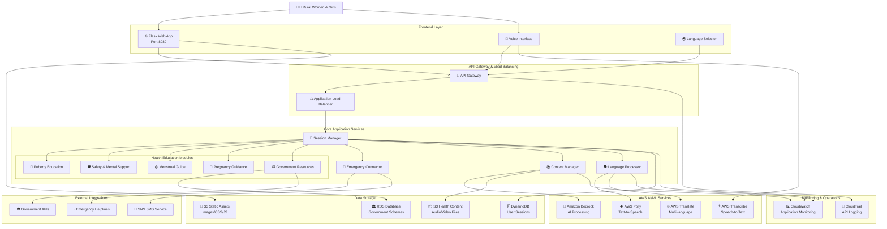
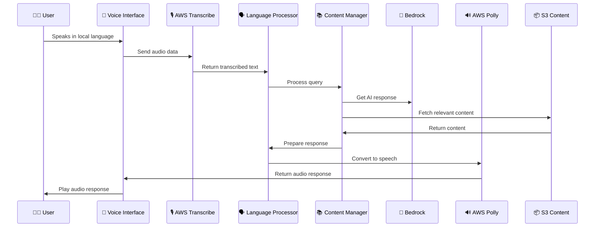
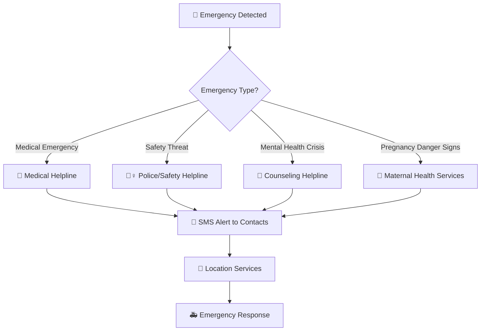
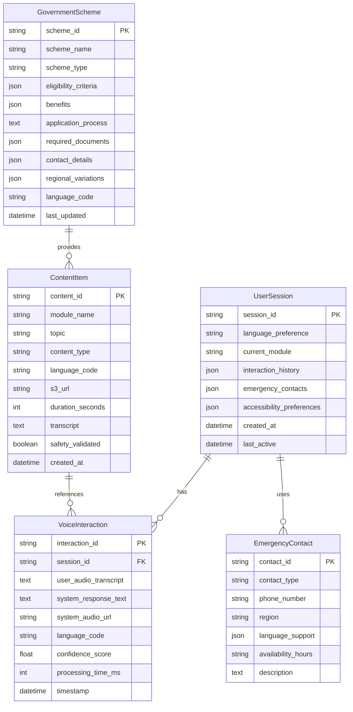
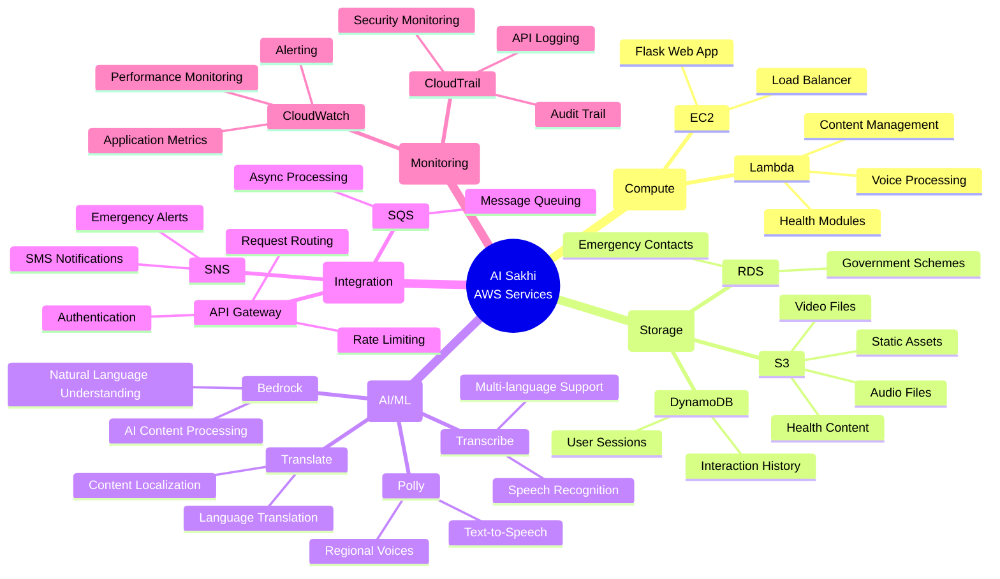
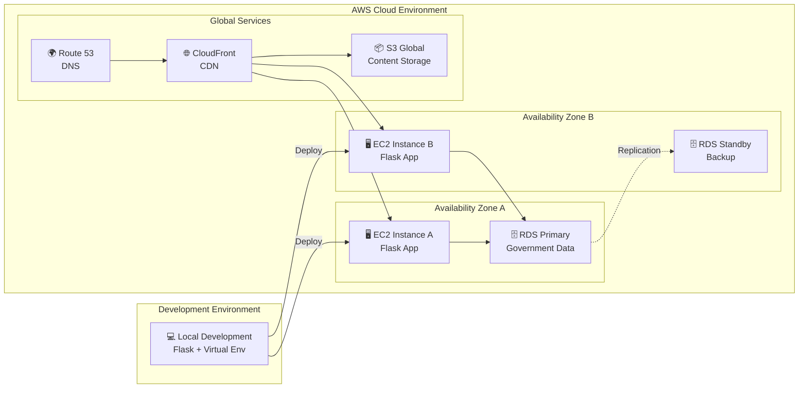
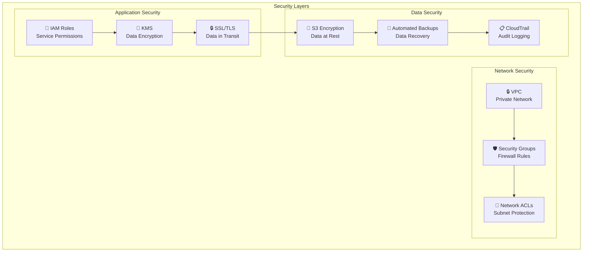
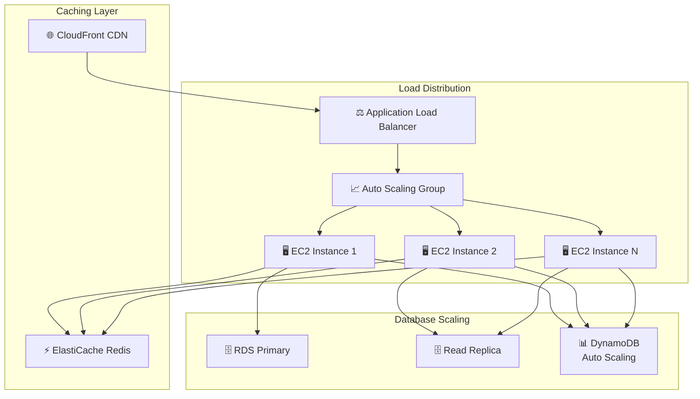

# AI Sakhi - Comprehensive Architecture Diagram

## Overview
This document provides a comprehensive architecture diagram for the AI Sakhi Voice-First Health Companion application, designed to serve rural women and girls with health education and guidance.

## 📋 Related Documentation

For additional architecture resources, see:
- **Architecture Summary**: `AI-SAKHI-ARCHITECTURE-SUMMARY.md` - Comprehensive overview of the entire system
- **Diagram Generation Guide**: `DIAGRAM-GENERATION-GUIDE.md` - Instructions for generating PNG diagrams
- **Python Script**: `generate_ai_sakhi_diagram.py` - Automated diagram generation script
- **MCP Setup Report**: `aws-diagram-mcp-setup-report.md` - MCP server setup and troubleshooting

## Main Architecture Diagram

### Mermaid Diagram (GitHub/GitLab Compatible)



## Voice Processing Flow Diagram



## Emergency Response Flow



## Data Model Relationships



## AWS Services Integration Map



## Component Interaction Matrix

| Component | Transcribe | Polly | S3 | DynamoDB | RDS | Bedrock | SNS |
|-----------|------------|-------|----|---------|----|---------|-----|
| Voice Interface | ✅ Input | ✅ Output | ❌ | ❌ | ❌ | ❌ | ❌ |
| Session Manager | ❌ | ❌ | ❌ | ✅ Read/Write | ❌ | ❌ | ❌ |
| Content Manager | ❌ | ❌ | ✅ Read | ❌ | ❌ | ✅ Process | ❌ |
| Language Processor | ❌ | ✅ Generate | ❌ | ❌ | ❌ | ✅ Process | ❌ |
| Health Modules | ❌ | ❌ | ✅ Read | ❌ | ❌ | ✅ Process | ❌ |
| Government Module | ❌ | ❌ | ✅ Read | ❌ | ✅ Read | ✅ Process | ❌ |
| Emergency Connector | ❌ | ❌ | ❌ | ❌ | ✅ Read | ❌ | ✅ Send |

## Deployment Architecture



## Security Architecture



## Performance & Scalability



## How to Use These Diagrams

### 1. GitHub/GitLab Rendering
These Mermaid diagrams will render automatically in markdown files on GitHub and GitLab.

### 2. VS Code
Install the "Mermaid Preview" extension to view diagrams locally.

### 3. Online Tools
- Copy diagram code to [Mermaid Live Editor](https://mermaid.live/)
- Use [draw.io](https://app.diagrams.net/) for interactive versions
- Export to PNG, SVG, or PDF formats

### 4. Documentation Integration
- Include in technical documentation
- Use in architecture reviews
- Reference in development planning

## AWS Diagram MCP Server Code

For when the Windows compatibility issue is resolved, here's the Python code for the AWS Diagram MCP Server:

```python
# AI Sakhi Architecture Diagram - AWS MCP Server Code
with Diagram("AI Sakhi - Voice-First Health Companion", show=False, direction="TB"):
    # User Layer
    user = User("Rural Women & Girls")
    
    # Frontend Layer
    with Cluster("Frontend Layer"):
        web_app = EC2("Flask Web App (Port 8080)")
        voice_ui = Lambda("Voice Interface")
        lang_selector = Lambda("Language Selector")
    
    # API Gateway Layer
    with Cluster("API Gateway & Load Balancing"):
        api_gateway = APIGateway("API Gateway")
        load_balancer = ELB("Application Load Balancer")
    
    # Core Application Services
    with Cluster("Core Application Services"):
        session_mgr = Lambda("Session Manager")
        
        with Cluster("Health Education Modules"):
            puberty_mod = Lambda("Puberty Education")
            safety_mod = Lambda("Safety & Mental Support")
            menstrual_mod = Lambda("Menstrual Guide")
            pregnancy_mod = Lambda("Pregnancy Guidance")
            govt_mod = Lambda("Government Resources")
        
        emergency_svc = Lambda("Emergency Connector")
        content_mgr = Lambda("Content Manager")
        lang_processor = Lambda("Language Processor")
    
    # AI/ML Services Layer
    with Cluster("AWS AI/ML Services"):
        transcribe = Transcribe("Speech-to-Text")
        polly = Polly("Text-to-Speech")
        translate = Translate("Multi-language Support")
        bedrock = Bedrock("AI Content Processing")
    
    # Data Storage Layer
    with Cluster("Data Storage"):
        s3_content = S3("Health Content (Audio/Video)")
        s3_static = S3("Static Assets (Images/CSS/JS)")
        dynamodb = Dynamodb("User Sessions")
        rds = RDS("Government Schemes Database")
    
    # Monitoring & Operations
    with Cluster("Monitoring & Operations"):
        cloudwatch = CloudWatch("Application Monitoring")
        cloudtrail = CloudTrail("API Logging")
    
    # External Services
    with Cluster("External Integrations"):
        helpline_api = Lambda("Emergency Helplines")
        govt_api = Lambda("Government APIs")
        sms_service = SNS("SMS Notifications")
    
    # Connection flows
    user >> [web_app, voice_ui]
    [web_app, voice_ui, lang_selector] >> api_gateway
    api_gateway >> load_balancer >> session_mgr
    
    session_mgr >> [puberty_mod, safety_mod, menstrual_mod, pregnancy_mod, govt_mod]
    session_mgr >> [emergency_svc, content_mgr, lang_processor]
    
    voice_ui >> transcribe
    lang_processor >> [polly, translate]
    content_mgr >> bedrock
    
    content_mgr >> s3_content
    web_app >> s3_static
    session_mgr >> dynamodb
    govt_mod >> rds
    
    emergency_svc >> [helpline_api, sms_service]
    govt_mod >> govt_api
    
    [session_mgr, content_mgr, lang_processor] >> cloudwatch
    api_gateway >> cloudtrail
```

This comprehensive architecture diagram provides multiple views and formats for the AI Sakhi application, suitable for different audiences and use cases.