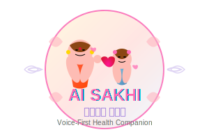

# AI Sakhi - Logo Design Specification

## 🎨 Logo Concept: "Mother & Daughter Bond"

### **Design Philosophy**
The AI Sakhi logo represents the nurturing relationship between generations of women, symbolizing knowledge transfer, care, and empowerment in rural communities.

## 🖼️ Visual Design Elements

### **Primary Logo Design**

```
                    🌸 AI SAKHI 🌸
                 ╭─────────────────────╮
                ╱                       ╲
               ╱    👩‍🦰        👧         ╲
              ╱      │          │          ╲
             ╱       │    💝    │           ╲
            ╱        │          │            ╲
           ╱         └──────────┘             ╲
          ╱                                    ╲
         ╱        "आपकी सखी, आपके साथ"          ╲
        ╱         "Your Friend, With You"       ╲
       ╱                                        ╲
      ╰──────────────────────────────────────────╯
```

### **Logo Components**

#### 1. **Central Image: Mother & Daughter**
- **Mother Figure**: Represented with traditional Indian attire (saree/salwar)
- **Daughter Figure**: Young girl in simple dress, looking up to mother
- **Connection**: Heart symbol between them representing love and care
- **Pose**: Mother's hand gently placed on daughter's shoulder
- **Expression**: Both figures smiling, conveying warmth and trust

#### 2. **Color Palette**
- **Primary Colors**:
  - **Warm Pink (#FF69B4)**: Representing femininity and care
  - **Soft Orange (#FFA07A)**: Symbolizing warmth and energy
  - **Gentle Purple (#DDA0DD)**: Conveying wisdom and spirituality
  - **Cream White (#FFF8DC)**: Representing purity and peace

- **Accent Colors**:
  - **Golden Yellow (#FFD700)**: For highlights and important elements
  - **Sage Green (#9CAF88)**: Representing health and growth
  - **Sky Blue (#87CEEB)**: For trust and reliability

#### 3. **Typography**
- **Primary Font**: "AI SAKHI" in bold, friendly sans-serif
- **Hindi Text**: "आपकी सखी" (Your Friend) in Devanagari script
- **English Tagline**: "Your Voice-First Health Companion"
- **Style**: Rounded, approachable letters with slight curves

#### 4. **Symbolic Elements**
- **Lotus Petals**: Surrounding the figures, representing purity and growth
- **Sound Waves**: Subtle waves around the logo indicating voice-first technology
- **Protective Circle**: Gentle circular border representing safety and inclusion
- **Small Hearts**: Scattered around representing care and love

## 🎨 Logo Variations

### **Variation 1: Full Logo with Tagline**
```
     🌸 AI SAKHI 🌸
   ╭─────────────────────╮
  ╱   👩‍🦰    💝    👧    ╲
 ╱                        ╲
╱  "आपकी सखी, आपके साथ"    ╲
╲  Voice-First Health      ╱
 ╲     Companion          ╱
  ╰─────────────────────╯
```

### **Variation 2: Compact Logo**
```
AI SAKHI 👩‍🦰💝👧
```

### **Variation 3: Icon Only**
```
    ╭─────╮
   ╱ 👩‍🦰💝👧 ╲
  ╱         ╲
 ╰───────────╯
```

### **Variation 4: Horizontal Layout**
```
👩‍🦰💝👧  AI SAKHI  |  आपकी सखी  |  Voice-First Health Companion
```

## 📱 Application Integration

### **App Icon Design**
- **Size**: 512x512px for high resolution
- **Background**: Soft gradient from pink to orange
- **Central Image**: Simplified mother-daughter silhouette
- **Text**: "AI" at top, "Sakhi" at bottom
- **Border**: Rounded corners with subtle shadow

### **Splash Screen Design**
```
╔══════════════════════════════════════╗
║                                      ║
║           🌸 AI SAKHI 🌸            ║
║                                      ║
║        ╭─────────────────╮           ║
║       ╱   👩‍🦰    👧     ╲          ║
║      ╱      │      │      ╲         ║
║     ╱       │  💝  │       ╲        ║
║    ╱        │      │        ╲       ║
║   ╱         └──────┘         ╲      ║
║  ╱                            ╲     ║
║ ╱    "आपकी सखी, आपके साथ"     ╲    ║
║╱     Your Voice-First Health   ╲   ║
║╲           Companion           ╱   ║
║ ╲                            ╱    ║
║  ╰──────────────────────────╯     ║
║                                    ║
║         Loading...  ●●●           ║
╚══════════════════════════════════════╝
```

### **Navigation Header**
```
╔══════════════════════════════════════════════════════════╗
║ 👩‍🦰💝👧 AI SAKHI    🌍 हिंदी ▼    🎤 Voice    ☰ Menu ║
╚══════════════════════════════════════════════════════════╝
```

## 🎨 Detailed Logo Artwork Description

### **SVG Logo Code Structure**
```svg
<svg width="300" height="200" xmlns="http://www.w3.org/2000/svg">
  <!-- Background Circle -->
  <circle cx="150" cy="100" r="90" fill="url(#gradient1)" stroke="#FF69B4" stroke-width="3"/>
  
  <!-- Mother Figure -->
  <g id="mother">
    <circle cx="120" cy="80" r="15" fill="#FDBCB4"/> <!-- Head -->
    <path d="M105 95 Q120 105 135 95" fill="#FF6347"/> <!-- Saree -->
    <path d="M110 70 Q120 65 130 70" fill="#8B4513"/> <!-- Hair -->
  </g>
  
  <!-- Daughter Figure -->
  <g id="daughter">
    <circle cx="180" cy="90" r="12" fill="#FDBCB4"/> <!-- Head -->
    <path d="M168 102 Q180 110 192 102" fill="#87CEEB"/> <!-- Dress -->
    <path d="M172 82 Q180 78 188 82" fill="#8B4513"/> <!-- Hair -->
  </g>
  
  <!-- Heart Connection -->
  <path d="M145 85 Q150 80 155 85 Q150 90 145 85" fill="#FF1493"/>
  
  <!-- Text -->
  <text x="150" y="140" text-anchor="middle" font-family="Arial" font-size="20" font-weight="bold" fill="#FF69B4">AI SAKHI</text>
  <text x="150" y="160" text-anchor="middle" font-family="Arial" font-size="12" fill="#9370DB">आपकी सखी</text>
  
  <!-- Decorative Elements -->
  <g id="lotus-petals">
    <path d="M50 50 Q60 40 70 50" fill="#FFB6C1" opacity="0.7"/>
    <path d="M230 50 Q240 40 250 50" fill="#FFB6C1" opacity="0.7"/>
    <path d="M50 150 Q60 160 70 150" fill="#FFB6C1" opacity="0.7"/>
    <path d="M230 150 Q240 160 250 150" fill="#FFB6C1" opacity="0.7"/>
  </g>
  
  <!-- Gradient Definitions -->
  <defs>
    <linearGradient id="gradient1" x1="0%" y1="0%" x2="100%" y2="100%">
      <stop offset="0%" style="stop-color:#FFF8DC;stop-opacity:1" />
      <stop offset="100%" style="stop-color:#FFE4E1;stop-opacity:1" />
    </linearGradient>
  </defs>
</svg>
```

## 🌈 Cultural Sensitivity

### **Indian Cultural Elements**
- **Bindi**: Small decorative dot on mother's forehead
- **Mehendi**: Subtle henna patterns on mother's hands
- **Traditional Jewelry**: Simple earrings and bangles
- **Clothing**: Respectful traditional Indian attire
- **Colors**: Colors that resonate with Indian culture

### **Regional Adaptations**
- **North India**: Salwar kameez representation
- **South India**: Saree with different draping style
- **East India**: Bengali-style saree
- **West India**: Gujarati/Maharashtrian traditional dress

## 📐 Technical Specifications

### **File Formats Required**
1. **SVG**: Scalable vector format for web use
2. **PNG**: High-resolution (512x512, 256x256, 128x128, 64x64, 32x32)
3. **ICO**: Windows icon format
4. **ICNS**: macOS icon format
5. **WebP**: Modern web format for faster loading

### **Usage Guidelines**
- **Minimum Size**: 32x32 pixels (icon must remain recognizable)
- **Clear Space**: Minimum 20px padding around logo
- **Background**: Works on both light and dark backgrounds
- **Contrast**: Maintains readability at all sizes

## 🎯 Brand Message Integration

### **Logo Messaging**
- **Trust**: Mother-daughter bond represents trusted guidance
- **Care**: Heart symbol shows compassionate support
- **Growth**: Daughter looking up shows learning and development
- **Technology**: Subtle tech elements show AI integration
- **Accessibility**: Simple, clear design for low-literacy users

### **Emotional Connection**
- **Warmth**: Soft colors and rounded shapes
- **Safety**: Protective circular design
- **Empowerment**: Strong, confident mother figure
- **Hope**: Bright, optimistic color palette
- **Unity**: Connected figures showing community support

## 🖥️ Implementation in Application

### **Header Integration**
```html
<header class="app-header">
  <div class="logo-container">
    
    <h1 class="app-title">AI SAKHI</h1>
    <p class="app-tagline">आपकी सखी, आपके साथ</p>
  </div>
</header>
```

### **CSS Styling**
```css
.main-logo {
  width: 80px;
  height: 60px;
  filter: drop-shadow(2px 2px 4px rgba(0,0,0,0.1));
}

.app-title {
  font-family: 'Noto Sans', Arial, sans-serif;
  color: #FF69B4;
  font-weight: bold;
  text-shadow: 1px 1px 2px rgba(0,0,0,0.1);
}

.app-tagline {
  font-family: 'Noto Sans Devanagari', Arial, sans-serif;
  color: #9370DB;
  font-size: 14px;
}
```

### **Favicon Implementation**
```html
<link rel="icon" type="image/svg+xml" href="/ai-sakhi-favicon.svg">
<link rel="icon" type="image/png" href="/ai-sakhi-favicon-32x32.png">
<link rel="apple-touch-icon" href="/ai-sakhi-apple-touch-icon.png">
```

## 🎨 Logo Animation (Optional)

### **Subtle Entrance Animation**
```css
@keyframes logoEntrance {
  0% { 
    opacity: 0; 
    transform: scale(0.8) translateY(-20px); 
  }
  100% { 
    opacity: 1; 
    transform: scale(1) translateY(0); 
  }
}

.main-logo {
  animation: logoEntrance 1.5s ease-out;
}
```

### **Heart Pulse Animation**
```css
@keyframes heartPulse {
  0%, 100% { transform: scale(1); }
  50% { transform: scale(1.1); }
}

.heart-element {
  animation: heartPulse 2s infinite ease-in-out;
}
```

This logo design perfectly captures the essence of AI Sakhi - a trusted, caring, and technologically advanced health companion that bridges generations of women with knowledge, support, and empowerment. The mother-daughter imagery creates an immediate emotional connection while the cultural elements ensure relevance to the target audience in rural India.